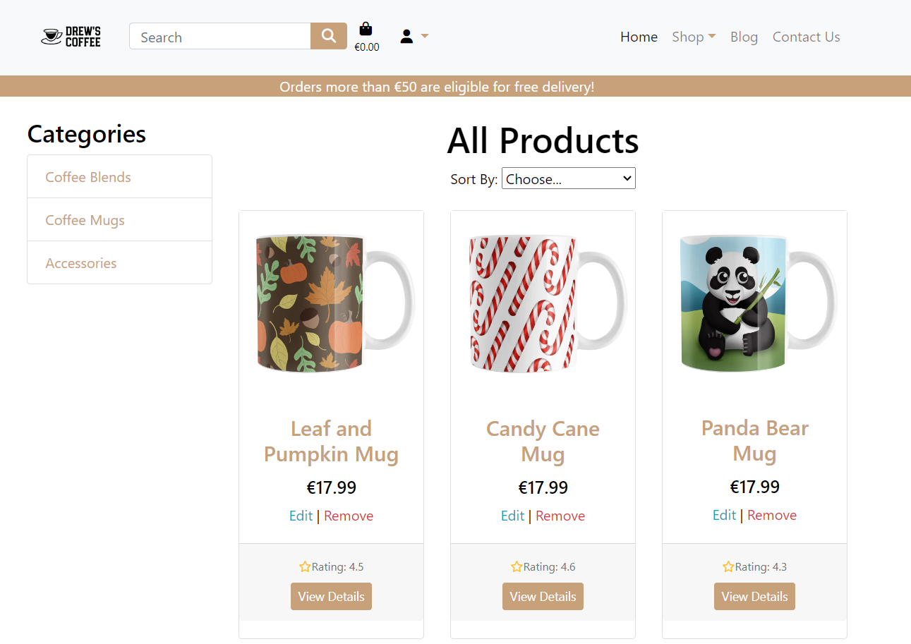
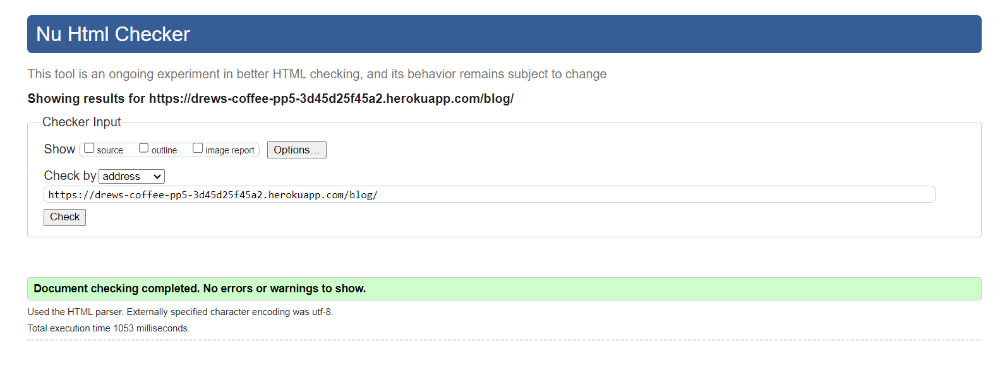

# Drew's Coffee PP5-Ecommerce

**Developer: Anthony Haj Ibrahim **

💻 [Visit live website]()  
(Ctrl + click to open in new tab)

## Table of Contents
  - [Executive Summary](#executive-summary)
     - [Market Analysis](#market-analysis)
     - [Marketing and Sales Strategy](#marketing-and-sales-strategy)
     - [Conclusion](#conclusion)
  - [Marketing](#marketing)
     - [Social Media](#social-media)
     - [Mailing List](#mailing-list)
  - [User Goals](#user-goals)
  - [Site Owner Goals](#site-owner-goals)
  - [User Experience](#user-experience)
  - [User Stories](#user-stories)
  - [Design](#design)
    - [Colors](#colors)
    - [Fonts](#fonts)
    - [Structure](#structure)
      - [Website pages](#website-pages)
      - [AWS](#aws)
      - [Database](#database)
      - [Models](#models)
  - [Technologies Used](#technologies-used)
  - [Features](#features)
  - [Validation](#validation)
  - [Testing](#testing)
    - [Manual testing](#manual-testing)
    - [Tests on various devices](#tests-on-various-devices)
    - [Browser compatibility](#browser-compatibility)
  - [Bugs](#bugs)
  - [Deployment](#deployment)
  - [Credits](#credits)
  - [Acknowledgements](#acknowledgements)

  ## Business Plan  
### Executive Summary:

#### Introduction
Drew's Coffee is an e-commerce platform specializing in high-quality coffee and coffee-related accessories. Built on a reliable Django framework, this digital marketplace offers more than just products; it is a destination for coffee connoisseurs and casual drinkers alike. Accompanying the shopping experience is a rich blog section that serves up insights, tips, and the latest trends in the coffee world

The primary aim of Drew's Coffee is to serve as a bridge between distinguished coffee suppliers and coffee lovers, enhancing the buying experience through a sophisticated, easy-to-use platform. Technical objectives include superior load times, mobile-friendly interfaces, and efficient search functionalities

### Market Analysis:

The global coffee market is a competitive landscape. Drew's Coffee sets itself apart through an unyielding commitment to quality, both in product selection and user interface. It targets discerning customers who appreciate quality over quantity

### Marketing and Sales Strategy:

1. Digital Presence:
Our primary channel for reaching consumers is through digital platforms. Drew's Coffee will maintain an active online presence through various social media platforms such as Instagram, Facebook, and Twitter, leveraging the power of sponsored ads and organic content to attract and engage consumers

2. SEO and Content Marketing:
The blog section on Drew's Coffee's website will be a strategic tool for organic growth. Utilizing SEO-friendly articles that cover a variety of topics around coffee culture and brewing techniques

3. Email Marketing:
Regular newsletters and targeted email campaigns will keep our customer base engaged and informed about new product releases, special discounts, and exclusive events. Advanced analytics will be employed to segment our audience and personalize the content for maximum impact

### Conclusion

In summary, Drew's Coffee aims to be a groundbreaking venture in the coffee market by providing high-quality products complemented by a seamless online shopping experience. With a robust technological backbone powered by Django and a carefully planned marketing strategy, this platform aspires to carve a unique niche in the e-commerce world. From user-focused design to an array of features aimed at enhancing both user and owner goals, Drew's Coffee is engineered for scalability and adaptability. This README serves as a thorough documentation of the project, outlining our vision, planning, and execution strategies. We invite stakeholders, developers, and users alike to explore this document to gain a holistic understanding of Drew's Coffee and its promising future

## Marketing

### Social Media
Drew's Coffee maintains active Facebook and Instagram accounts to engage with our community and keep them updated on new products, promotions, and coffee culture. Both platforms are strategically used to boost brand awareness and drive traffic to our e-commerce site. Periodic analytics reviews guide our content and promotional strategies to continually grow and serve our community better

!!!!!!!!!!!!!!!

### Mailing List
Drew's Coffee leverages Mailchimp to manage our mailing list effectively. Subscribers receive bi-weekly newsletters containing exclusive promotions, updates on new coffee releases, and curated content related to coffee culture. This mailing list serves as a direct channel of communication to our most engaged customers, and analytics from Mailchimp assist us in optimizing the content and timing of these communications to enhance user engagement and drive sales

!!!!!!!!!!!!!!!!!!!!!!!!!!

## User Goals

- General: Easy navigation, accurate information
- Product Page: Detailed product info, clear images, reviews and ratings
- Contact Us Page: Readily available contact information, inquiry form
- Blog Page: Valuable content, search and filter options
- Cart Page: Simple checkout, edit and review options
- Profile Page: Personalized experience, strong security measures

## Site Owner Goals

- Achieve consistent user growth while maintaining strong user engagement
- Product Page: Encourage product sales, collect user reviews
- Contact Page: Generate leads, offer excellent customer service
- Blog Page: Build authority, encourage engagement and time-on-page
- Cart Page: Maximize conversions, minimize cart abandonment
- Profile Page: Encourage sign-ups, collect valuable user data

## User Experience

### Target Audience
The primary target audience for Drew's Coffee consists of coffee enthusiasts spanning various age groups, particularly those between the ages of 25 and 50. These individuals value quality and origin-specific coffees and are willing to invest a bit more in their daily brew. Additionally, given that the website will feature a blog section, we aim to attract those interested in enriching their knowledge about coffee, its origins, and brewing techniques

### User Requirements and Expectations
- Easy navigation through the website to find products, blogs, and contact information
- Secure and straightforward checkout process
- Access to detailed product descriptions and high-quality images
- Responsive design that offers a seamless experience across various devices
- An informative blog section with regularly updated content
- Efficient search functionality to quickly locate desired products or information
- A user-friendly profile section to track orders and manage personal information
- Quick and accessible customer support through a Contact us page.
- Option to subscribe to a newsletter for updates and promotions

## User Stories

### Viewing and Navigation

1. As a Shopper I can use a navbar, footer, and social icons so that I can easily navigate the site
2. As a Shopper I can be notified of my actions so that I can be notified if my action was a success or not
3. As a Shopper, I want to see my login status (logged in or logged out) and who I am logged in as (username or email) displayed on the website, so I can easily understand my current session status
4. As a Shopper I can navigate to the shopping pages so that I can view all products available
5. As a Shopper I can **view product's details so that I can see more information about a product
6. As a Shopper I can view a preview of my cart and grand total at any time so that I can know what I am purchasing and cost

### User Accounts

7. As a Site User I can login and logout so that I can access my account easily
8. As a Site User I can register for an account so that I can view my profile and orders
9. As a Site User I can recover my password so that I can set a new password in case its forgotten
10. As a Site User I can receive an email confirmation when registering so that I can be notified registration is complete
11. As a Site User I can have a profile so that I can store my information and order history so that I can checkout faster on my next shop

### Sort and Search 

12. As a Shopper I can search for a product by name or description so that I can find a specific product
13. As a Shopper I can sort by category so that I can select products of a specific category
14. As a Shopper I can sort by price so that I can select products of a specific price range (low-high/high-low)
15. As a Shopper I can see my search results so that I can shop a specific product

### Cart and Payment

16. As a Shopper I can view products in my cart so that I can review my cart before checkout
17. As a Shopper I can select the quantity of a product so that I can buy more of a certain product
18. As a Shopper I can adjust item quantity my basket so that I can add or remove more quantities to my cart
19. As a Shopper I can receive order confirmation so that I can be notified of a successful purchase
20. As a Shopper I can receive email confirmation so that I can have a receipt of my purchase

### Admin Functionality

21. As a Store Owner I can add a product so that I can add new products to the shop
22. As a Store Owner I can edit a product so that I can edit existing products in the shop
23. As a Store Owner I can delete a product so that I can delete existing products from the shop

### Kanban, Epics & User Stories
- GitHub Kanban was used for user stories
- Epics were created using the milestones feature

Epic Overview

Epic 1

Epic 2

Epic 3

Epic 4

Epic 5

Kanban

User Stories

## Design

### Colors

Colors chosen for were a creamy brown and darker brown color representing coffee with a 
light theme.

See Color Palette

### Fonts 

The fonts selected were from Google Fonts.

See Fonts

# Structure

The site was structured using a basic logo and navigation layout showing all relevant links
 and hamburger menu for smaller devices. The footer consists of 3 social media links and 
email sign up form and useful links as well as contact information.

## Website pages

- The site consists of the following pages:
  - Home
  - Products
  - Product Detail
  - Bag
  - Checkout
  - Checkout Success
  - Blog
  - Blog Detail
  - Contact
  - Login
  - Register
  - Profile
  - Logout
  - Reset Password
  - 404 Page

## AWS 

I am using AWS S3 buckets to store my data. It is a cloud storage service provided by Amazon
Web Services. 

See Color Palette

See Color Palette

!!!!!!!!!!!!!!!!!!!!!!!!!!!!!!!!

## Database

I built my database using PostgreSQL. I have opted for PostgreSQL as my database
 management system, owing to its robust, reliable, and high-performing open-source
 architecture. It serves as a versatile platform for adeptly handling and structuring
 my data.

See Database Schema

## Models

### User Model

| Key        | Name         | Type        |
| ---------- | ------------ | ----------- |
| PrimaryKey | user_id      | AutoField   |
|            | password     | VARCHAR(45) |
|            | last_login   | VARCHAR(45) |
|            | is_superuser | BOOLEAN     |
|            | username     | VARCHAR(45) |
|            | first_name   | VARCHAR(45) |
|            | last_name    | VARCHAR(45) |
|            | email        | VARCHAR(45) |
|            | is_staff     | BOOLEAN     |
|            |              |             |
|            | is_active    | BOOLEAN     |
|            | date_joined  | VARCHAR(45) |

### User Profile Model

| Key        | Name                 | Type          |
| ---------- | -------------------- | ------------- |
| PrimaryKey | user_profile_id      | AutoField     |
| ForeignKey | user                 | User model    |
|            | default_phone_number | CharField[20] |
|            | default_address1     | CharField[80] |
|            | default_address2     | CharField[80] |
|            | default_town_city    | CharField[40] |
|            | default_county       | CharField[80] |
|            | default_postcode     | CharField[20] |
|            | default_country      | CharField[40] |

### Category Model  

| Key        | Name          | Type      |
| ---------- | ------------- | --------- |
| PrimaryKey | category_id   | AutoField |
|            | name          | Char[254] |
|            | friendly_name | Char[254] |

### Product Model

| Key        | Name        | Type           |
| ---------- | ----------- | -------------- |
| PrimaryKey | product_id  | AutoField      |
|            | code        | CharField[50]  |
|            | brand       | CharField[50]  |
|            | name        | CharField[50]  |
|            | description | TextField      |
|            | has_sizes   | BooleanField   |
|            | price       | DecimalField   |
| ForeignKey | category    | Category model |
|            | rating      | DecimalField   |
|            | image       | ImageField     |

### Order Model

| Key        | Name            | Type               |
| ---------- | --------------- | ------------------ |
| PrimaryKey | order_id        | AutoField          |
|            | order_number    | CharField[40]      |
| ForeignKey | user_profile    | User profile Model |
|            | full_name       | CharField[50]      |
|            | email           | EmailField[254]    |
|            | phone_number    | CharField[20]      |
|            | address1        | CharField[80]      |
|            | address2        | CharField[80]      |
|            | town_city       | CharField[40]      |
|            | postcode        | CharField[20]      |
|            | county          | CharField[80]      |
|            | country         | CharField[40]      |
|            | date            | DateTimeField      |
|            | delivery_cost   | DecimalField[6]    |
|            | order_total     | DecimalField[10]   |
|            | grand_total     | DecimalField[10]   |
|            | original_bag    | TextField          |
|            | stripe_pid      | CharField          |

### OrderLineItem Model  

| Key        | Name             | Type            |
| ---------- | ---------------- | --------------- |
| PrimaryKey | OrderLineItem_id | AutoField       |
| ForeignKey | order            | Order Model     |
| ForeignKey | product          | Product Model   |
|            | product_size     | CharField[2]    |
|            | quantity         | IntegerField    |
|            | line_item_total  | DecimalField[6] |

### ContactUs Model

| Key        | Name         | Type             |
| ---------- | ------------ | ---------------- |
| PrimaryKey | message_id   | AutoField        |
|            | created_date | DateTimeField    |
| ForeignKey | user         | User model       |
|            | name         | CharField        |
|            | email        | EmailField       |
|            | phone        | PhoneNumberField |
|            | body         | TextField        |  

## Technologies Used

### Languages & Frameworks

- HTML
- CSS
- Javascript
- Python
- Django

### Libraries & Tools

- [Am I Responsive](http://ami.responsivedesign.is/)
- [Bootstrap 4](https://getbootstrap.com/)
- [Favicon.io](https://favicon.io)
- [Chrome dev tools](https://developers.google.com/web/tools/chrome-devtools/)
- [Font Awesome](https://fontawesome.com/)
- [Git](https://git-scm.com/)
- [GitHub](https://github.com/)
- [Google Fonts](https://fonts.google.com/)
- [Heroku Platform](https://id.heroku.com/login)
- [AWS](https://aws.amazon.com/)
- [jQuery](https://jquery.com)
- [Postgres](https://www.postgresql.org/)
- [PyCharm](https://www.jetbrains.com/pycharm/download/?section=windows)
- Validation:
  - [WC3 Validator](https://validator.w3.org/)
  - [Jigsaw W3 Validator](https://jigsaw.w3.org/css-validator/)
  - [JShint](https://jshint.com/)
  - [CI Python Liner(PEP8)](https://pep8ci.herokuapp.com/)
  - [Lighthouse](https://developers.google.com/web/tools/lighthouse/)
  - [Wave Validator](https://wave.webaim.org/)

## Features

### Search Engine Optimisation (SEO)

In the HTML structure of my web application's pages, I have incorporated meta tags to
enhance search engine optimization (SEO). Specifically, the 'description' tag offers a concise overview of the page's content aiding users and search engines alike.
Concurrently, the 'keywords' tag enumerates pertinent terms, thereby assisting
search engines in contextualizing the webpage and aligning it with related search queries.

### Home page

- Home page contains navigation bar, a main body, and a footer

See Feature

### Navigation Bar

- Fully Responsive.
- Custom logo for the business
- Consists of Home, Shop, Blog, Contact Us, Shopping Bag, Register, and Login
- Indicates login/logout in status.
- Displayed on all pages.
- Allows the user to search for products by name or description
- On smaller devices switches to hamburger menu

See Feature

### Mailing List Sign Up

- Mailchimp signup for email mailing list.

!!!!!!!!!!!!!!!!!!!!!!!!!!!!!!!!!!!!!!!!!!

### Footer

- Contains social media links, copyright, and contact information.
- A Facebook and Instagram page for the business is used.
- Displayed across all pages.

!!!!!!!!!!!!!!!!!!!!!!!!!!!!!!!!!!!!!!!!!!

### Sign up / Register
- Contains form for users to register an account
- All fields are required for registration

See Feature

### Sign In
- User can login here

See Feature

### Sign Out
- Allows the user to securely sign out.
- Ask user if they are sure they want to sign out.

See Feature

### Profile
- Allows the user to update their information and see their order history. 

See Feature

### Shop
- Allows the user to view the listed products in the shop
- Products can be filtered by category, name, price, or rating

See Feature

### Product Detail
- Allows the user to view the products details.
- User can select quantity and add to shopping bag

See Feature

### Add, Edit, Delete Product
- Allows the admin to add, edit, and delete new or existing products.  

See Add Feature

See Edit Feature

See Delete Feature

### Shopping Bag
- Allows the user to view the basket with their items
- When adding to bag, a popup will show preview of current bag

See Feature

### Checkout
- Allows the user to purchase items in their basket
- Users use stripe for card payments.
- On successful purchace, user will receive conformation email

See Feature

### Blog
- The blog displays each post made by a staff member
- Expands into the selected blog the user wishes to read 

See Feature

!!!!!!!!!!!!!!!!!!!!!!!!!!!!!!!!!!!!!!!!!!!!!!!!!!!!!!!!!!!

### Contact Us
- A contact page with all contact details listed
- Users can send a message using the message form
- Shows Contact Information and a map

See Feature

## HTML Validation

The W3C Markup Validation Service was used to validate the HTML of the website.

### Home   

See Image

- No Errors Found

### Shop

See Image

- No Errors Found

### Product Detail

See Image

- No Errors Found

### Add Product

See Image

- No Errors Found

### Edit Product

See Image

- No Errors Found

### Shopping Bag

See Image

- No Errors Found

### Checkout

See Image

- No Errors Found

### Checkout Success

See Image

- No Errors Found

### Profile

See Image

- No Errors Found

### Blog

See Image

  !!!!!!!!!!!!!!!!!!!!!!!!!!!!!!!!!!!!!!!

- No Errors Found

### Contact

See Image

- No Errors Found

### Login

See Image

- No Errors Found

### Logout

See Image

- No Errors Found

### Register

See Image

- No Errors Found

### 404 Page

See Image

- No Errors Found

### CSS Validation

base.css

products.css

checkout.css

