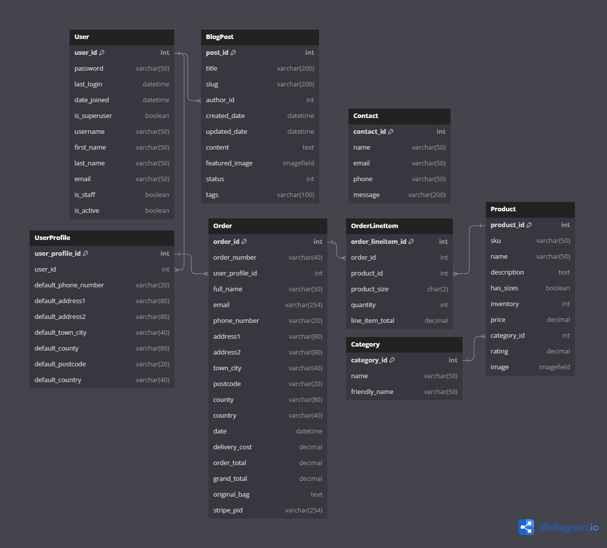
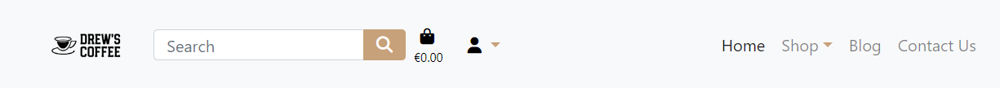
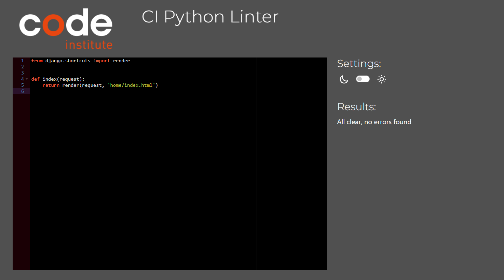
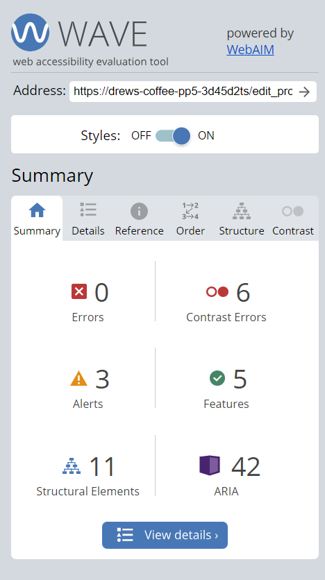

# Drew's Coffee PP5-Ecommerce

**Developer: Anthony Haj Ibrahim **

💻 [Visit live website]()  
(Ctrl + click to open in new tab)

## Table of Contents
  - [Executive Summary](#executive-summary)
     - [Market Analysis](#market-analysis)
     - [Marketing and Sales Strategy](#marketing-and-sales-strategy)
     - [Conclusion](#conclusion)
  - [Marketing](#marketing)
     - [Social Media](#social-media)
     - [Mailing List](#mailing-list)
  - [User Goals](#user-goals)
  - [Site Owner Goals](#site-owner-goals)
  - [User Experience](#user-experience)
  - [User Stories](#user-stories)
  - [Wireframes](#wireframes)
  - [Design](#design)
    - [Colors](#colors)
    - [Fonts](#fonts)
    - [Structure](#structure)
      - [Website pages](#website-pages)
      - [AWS](#aws)
      - [Database](#database)
      - [Models](#models)
  - [Technologies Used](#technologies-used)
  - [Features](#features)
  - [Validation](#validation)
  - [Testing](#testing)
    - [Manual testing](#manual-testing)
    - [Tests on various devices](#tests-on-various-devices)
    - [Browser compatibility](#browser-compatibility)
  - [Bugs](#bugs)
  - [Deployment](#deployment)
  - [Credits](#credits)
  - [Acknowledgements](#acknowledgements)

  ## Business Plan  
### Executive Summary:

#### Introduction
Drew's Coffee is an e-commerce platform specializing in high-quality coffee and coffee-related accessories. Built on a reliable Django framework, this digital marketplace offers more than just products; it is a destination for coffee connoisseurs and casual drinkers alike. Accompanying the shopping experience is a rich blog section that serves up insights, tips, and the latest trends in the coffee world

The primary aim of Drew's Coffee is to serve as a bridge between distinguished coffee suppliers and coffee lovers, enhancing the buying experience through a sophisticated, easy-to-use platform. Technical objectives include superior load times, mobile-friendly interfaces, and efficient search functionalities

### Market Analysis:

The global coffee market is a competitive landscape. Drew's Coffee sets itself apart through an unyielding commitment to quality, both in product selection and user interface. It targets discerning customers who appreciate quality over quantity

### Marketing and Sales Strategy:

1. Digital Presence:
Our primary channel for reaching consumers is through digital platforms. Drew's Coffee will maintain an active online presence through various social media platforms such as Instagram, Facebook, and Twitter, leveraging the power of sponsored ads and organic content to attract and engage consumers

2. SEO and Content Marketing:
The blog section on Drew's Coffee's website will be a strategic tool for organic growth. Utilizing SEO-friendly articles that cover a variety of topics around coffee culture and brewing techniques

3. Email Marketing:
Regular newsletters and targeted email campaigns will keep our customer base engaged and informed about new product releases, special discounts, and exclusive events. Advanced analytics will be employed to segment our audience and personalize the content for maximum impact

### Conclusion

In summary, Drew's Coffee aims to be a groundbreaking venture in the coffee market by providing high-quality products complemented by a seamless online shopping experience. With a robust technological backbone powered by Django and a carefully planned marketing strategy, this platform aspires to carve a unique niche in the e-commerce world. From user-focused design to an array of features aimed at enhancing both user and owner goals, Drew's Coffee is engineered for scalability and adaptability. This README serves as a thorough documentation of the project, outlining our vision, planning, and execution strategies. We invite stakeholders, developers, and users alike to explore this document to gain a holistic understanding of Drew's Coffee and its promising future

## Marketing

### Social Media
Drew's Coffee maintains active Facebook and Instagram accounts to engage with our community and keep them updated on new products, promotions, and coffee culture. Both platforms are strategically used to boost brand awareness and drive traffic to our e-commerce site. Periodic analytics reviews guide our content and promotional strategies to continually grow and serve our community better

[Visit Facebook Page](https://www.facebook.com/profile.php?id=61551717157784)  
(Ctrl + click to open in new tab)

[Visit Instagram Page](https://www.instagram.com/drewscoffee1/)  
(Ctrl + click to open in new tab)

### Mailing List
Drew's Coffee leverages Mailchimp to manage our mailing list effectively. Subscribers receive bi-weekly newsletters containing exclusive promotions, updates on new coffee releases, and curated content related to coffee culture. This mailing list serves as a direct channel of communication to our most engaged customers, and analytics from Mailchimp assist us in optimizing the content and timing of these communications to enhance user engagement and drive sales

Mailchimp

## User Goals

- General: Easy navigation, accurate information
- Product Page: Detailed product info, clear images, reviews and ratings
- Contact Us Page: Readily available contact information, inquiry form
- Blog Page: Valuable content, search and filter options
- Cart Page: Simple checkout, edit and review options
- Profile Page: Personalized experience, strong security measures

## Site Owner Goals

- Achieve consistent user growth while maintaining strong user engagement
- Product Page: Encourage product sales, collect user reviews
- Contact Page: Generate leads, offer excellent customer service
- Blog Page: Build authority, encourage engagement and time-on-page
- Cart Page: Maximize conversions, minimize cart abandonment
- Profile Page: Encourage sign-ups, collect valuable user data

## User Experience

### Target Audience
The primary target audience for Drew's Coffee consists of coffee enthusiasts spanning various age groups, particularly those between the ages of 25 and 50. These individuals value quality and origin-specific coffees and are willing to invest a bit more in their daily brew. Additionally, given that the website will feature a blog section, we aim to attract those interested in enriching their knowledge about coffee, its origins, and brewing techniques

### User Requirements and Expectations
- Easy navigation through the website to find products, blogs, and contact information
- Secure and straightforward checkout process
- Access to detailed product descriptions and high-quality images
- Responsive design that offers a seamless experience across various devices
- An informative blog section with regularly updated content
- Efficient search functionality to quickly locate desired products or information
- A user-friendly profile section to track orders and manage personal information
- Quick and accessible customer support through a Contact us page.
- Option to subscribe to a newsletter for updates and promotions

## User Stories

### Viewing and Navigation

1. As a Shopper I can use a navbar, footer, and social icons so that I can easily navigate the site
2. As a Shopper I can be notified of my actions so that I can be notified if my action was a success or not
3. As a Shopper, I want to see my login status (logged in or logged out) displayed on the website, so I can easily understand my current session status
4. As a Shopper I can navigate to the shopping pages so that I can view all products available
5. As a Shopper I can view product's details so that I can see more information about a product
6. As a Shopper I can view a preview of my cart and grand total at any time so that I can know what I am purchasing and cost

### User Accounts

7. As a Site User I can login and logout so that I can access my account easily
8. As a Site User I can register for an account so that I can view my profile and orders
9. As a Site User I can recover my password so that I can set a new password in case its forgotten
10. As a Site User I can receive an email confirmation when registering so that I can be notified registration is complete
11. As a Site User I can have a profile so that I can store my information and order history so that I can checkout faster on my next shop

### Sort and Search 

12. As a Shopper I can search for a product by name or description so that I can find a specific product
13. As a Shopper I can sort by category so that I can select products of a specific category
14. As a Shopper I can sort by price so that I can select products of a specific price range (low-high/high-low)
15. As a Shopper I can see my search results so that I can shop a specific product

### Cart and Payment

16. As a Shopper I can view products in my cart so that I can review my cart before checkout
17. As a Shopper I can select the quantity of a product so that I can buy more of a certain product
18. As a Shopper I can adjust item quantity my bag so that I can add or remove more quantities to my bag
19. As a Shopper I can receive order confirmation so that I can be notified of a successful purchase
20. As a Shopper I can receive email confirmation so that I can have a receipt of my purchase

### Admin Functionality

21. As a Store Owner I can add a product so that I can add new products to the shop
22. As a Store Owner I can edit a product so that I can edit existing products in the shop
23. As a Store Owner I can delete a product so that I can delete existing products from the shop

### Kanban, Epics & User Stories
- GitHub Kanban was used for user stories
- Epics were created using the milestones feature

Epic Overview

Epic 1

Epic 2

Epic 3

Epic 4

Epic 5

Kanban

User Stories

## Wireframes

Wireframes were created using Balsamiq. A very handy tool for creating mockups for any application in order to help design, 
arrange, and plan for future product implementation

Home

Shop

Product Detail

Shopping Bag

Checkout

Profile

Blog

## Design

### Colors

Colors chosen for were a creamy brown and darker brown color representing coffee with a 
light theme.

See Color Palette

### Fonts 

The fonts selected were from Google Fonts.

See Fonts

# Structure

The site was structured using a basic logo and navigation layout showing all relevant links
 and hamburger menu for smaller devices. The footer consists of 3 social media links and 
email sign up form and useful links as well as contact information.

## Website pages

- The site consists of the following pages:
  - Home
  - Products
  - Product Detail
  - Bag
  - Checkout
  - Checkout Success
  - Blog
  - Blog Detail
  - Contact
  - Login
  - Register
  - Profile
  - Logout
  - Reset Password
  - 404 Page

## AWS 

I am using AWS S3 buckets to store my data. It is a cloud storage service provided by Amazon
Web Services. 

AWS

## Database

I built my database using PostgreSQL. I have opted for PostgreSQL as my database
 management system, owing to its robust, reliable, and high-performing open-source
 architecture. It serves as a versatile platform for adeptly handling and structuring
 my data.

See Database Schema

## Models

### User Model

| Key        | Name         | Type        |
| ---------- | ------------ | ----------- |
| PrimaryKey | user_id      | AutoField   |
|            | password     | VARCHAR(45) |
|            | last_login   | VARCHAR(45) |
|            | is_superuser | BOOLEAN     |
|            | username     | VARCHAR(45) |
|            | first_name   | VARCHAR(45) |
|            | last_name    | VARCHAR(45) |
|            | email        | VARCHAR(45) |
|            | is_staff     | BOOLEAN     |
|            |              |             |
|            | is_active    | BOOLEAN     |
|            | date_joined  | VARCHAR(45) |

### User Profile Model

| Key        | Name                 | Type          |
| ---------- | -------------------- | ------------- |
| PrimaryKey | user_profile_id      | AutoField     |
| ForeignKey | user                 | User model    |
|            | default_phone_number | CharField[20] |
|            | default_address1     | CharField[80] |
|            | default_address2     | CharField[80] |
|            | default_town_city    | CharField[40] |
|            | default_county       | CharField[80] |
|            | default_postcode     | CharField[20] |
|            | default_country      | CharField[40] |

### Category Model  

| Key        | Name          | Type      |
| ---------- | ------------- | --------- |
| PrimaryKey | category_id   | AutoField |
|            | name          | Char[254] |
|            | friendly_name | Char[254] |

### Product Model

| Key        | Name        | Type           |
| ---------- | ----------- | -------------- |
| PrimaryKey | product_id  | AutoField      |
|            | code        | CharField[50]  |
|            | brand       | CharField[50]  |
|            | name        | CharField[50]  |
|            | description | TextField      |
|            | has_sizes   | BooleanField   |
|            | price       | DecimalField   |
| ForeignKey | category    | Category model |
|            | rating      | DecimalField   |
|            | image       | ImageField     |

### Order Model

| Key        | Name            | Type               |
| ---------- | --------------- | ------------------ |
| PrimaryKey | order_id        | AutoField          |
|            | order_number    | CharField[40]      |
| ForeignKey | user_profile    | User profile Model |
|            | full_name       | CharField[50]      |
|            | email           | EmailField[254]    |
|            | phone_number    | CharField[20]      |
|            | address1        | CharField[80]      |
|            | address2        | CharField[80]      |
|            | town_city       | CharField[40]      |
|            | postcode        | CharField[20]      |
|            | county          | CharField[80]      |
|            | country         | CharField[40]      |
|            | date            | DateTimeField      |
|            | delivery_cost   | DecimalField[6]    |
|            | order_total     | DecimalField[10]   |
|            | grand_total     | DecimalField[10]   |
|            | original_bag    | TextField          |
|            | stripe_pid      | CharField          |

### OrderLineItem Model  

| Key        | Name             | Type            |
| ---------- | ---------------- | --------------- |
| PrimaryKey | OrderLineItem_id | AutoField       |
| ForeignKey | order            | Order Model     |
| ForeignKey | product          | Product Model   |
|            | product_size     | CharField[2]    |
|            | quantity         | IntegerField    |
|            | line_item_total  | DecimalField[6] |

### ContactUs Model

| Key        | Name         | Type             |
| ---------- | ------------ | ---------------- |
| PrimaryKey | message_id   | AutoField        |
|            | created_date | DateTimeField    |
| ForeignKey | user         | User model       |
|            | name         | CharField        |
|            | email        | EmailField       |
|            | phone        | PhoneNumberField |
|            | body         | TextField        |  

### Blog Model

| Key        | Name           | Type           |
|------------|----------------|----------------|
| PrimaryKey | id             | AutoField      |
|            | title          | CharField[200] |
|            | slug           | SlugField[200] |
| ForeignKey | author         | User model     |
|            | created_date   | DateTimeField  |
|            | updated_date   | DateTimeField  |
|            | content        | TextField      |
|            | featured_image | ImageField     |
|            | status         | IntegerField   |
|            | tags           | CharField[100] |

## Technologies Used

### Languages & Frameworks

- HTML
- CSS
- Javascript
- Python
- Django

### Libraries & Tools

- [Am I Responsive](http://ami.responsivedesign.is/)
- [Bootstrap 4](https://getbootstrap.com/)
- [Favicon.io](https://favicon.io)
- [Chrome dev tools](https://developers.google.com/web/tools/chrome-devtools/)
- [Font Awesome](https://fontawesome.com/)
- [Git](https://git-scm.com/)
- [GitHub](https://github.com/)
- [Google Fonts](https://fonts.google.com/)
- [Heroku Platform](https://id.heroku.com/login)
- [AWS](https://aws.amazon.com/)
- [jQuery](https://jquery.com)
- [Postgres](https://www.postgresql.org/)
- [PyCharm](https://www.jetbrains.com/pycharm/download/?section=windows)
- Validation:
  - [WC3 Validator](https://validator.w3.org/)
  - [Jigsaw W3 Validator](https://jigsaw.w3.org/css-validator/)
  - [JShint](https://jshint.com/)
  - [CI Python Liner(PEP8)](https://pep8ci.herokuapp.com/)
  - [Lighthouse](https://developers.google.com/web/tools/lighthouse/)
  - [Wave Validator](https://wave.webaim.org/)

## Features

### Search Engine Optimisation (SEO)

In the HTML structure of my web application's pages, I have incorporated meta tags to
enhance search engine optimization (SEO). Specifically, the 'description' tag offers a concise overview of the page's content aiding users and search engines alike.
Concurrently, the 'keywords' tag enumerates pertinent terms, thereby assisting
search engines in contextualizing the webpage and aligning it with related search queries.

### Home page

- Home page contains navigation bar, a main body, and a footer

See Feature

### Navigation Bar

- Fully Responsive.
- Custom logo for the business
- Consists of Home, Shop, Blog, Contact Us, Shopping Bag, Register, and Login
- Indicates login/logout in status.
- Displayed on all pages.
- Allows the user to search for products by name or description
- On smaller devices switches to hamburger menu

See Feature

### Mailing List Sign Up

- Mailchimp signup for email mailing list.

See Feature

### Footer

- Contains social media links, copyright, and contact information.
- A Facebook and Instagram page for the business is used.
- Displayed across all pages.

See Feature

### Sign up / Register
- Contains form for users to register an account
- All fields are required for registration

See Feature

### Sign In
- User can login here

See Feature

### Sign Out
- Allows the user to securely sign out.
- Ask user if they are sure they want to sign out.

See Feature

### Profile
- Allows the user to update their information and see their order history. 

See Feature

### Shop
- Allows the user to view the listed products in the shop
- Products can be filtered by category, name, price, or rating

See Feature

### Product Detail
- Allows the user to view the products details.
- User can select quantity and add to shopping bag

See Feature

### Add, Edit, Delete Product
- Allows the admin to add, edit, and delete new or existing products.  

See Add Feature

See Edit Feature

See Delete Feature

### Shopping Bag
- Allows the user to view the basket with their items
- When adding to bag, a popup will show preview of current bag

See Feature

### Checkout
- Allows the user to purchase items in their basket
- Users use stripe for card payments.
- On successful purchace, user will receive conformation email

See Feature

### Blog
- The blog displays each post made by a staff member
- Expands into the selected blog the user wishes to read 

See Feature

### Contact Us
- A contact page with all contact details listed
- Users can send a message using the message form
- Shows Contact Information and a map

See Feature

## HTML Validation

The W3C Markup Validation Service was used to validate the HTML of the website.

### Home   

See Image

- No Errors Found

### Shop

See Image

- No Errors Found

### Product Detail

See Image

- No Errors Found

### Add Product

See Image

- No Errors Found

### Edit Product

See Image

- No Errors Found

### Shopping Bag

See Image

- No Errors Found

### Checkout

See Image

- No Errors Found

### Checkout Success

See Image

- No Errors Found

### Profile

See Image

- No Errors Found

### Blog

See Image

 

- No Errors Found

### Contact

See Image

- No Errors Found

### Login

See Image

- No Errors Found

### Logout

See Image

- No Errors Found

### Register

See Image

- No Errors Found

### 404 Page

See Image

- No Errors Found

### CSS Validation

The W3C Jigsaw CSS Validation Service was used to validate the CSS of the website.

base.css

- No Errors Found

products.css

- No Errors Found

checkout.css

- No Errors Found

### JavaScript Validation

JSHint Validation Service was used to validate all javaScript files.

stripe-elements.js

quantity-script.js

- No Errors Found

## PEP8 Validation

### Bag

contexts.py

bag_filters.py

views.py

urls.py

### Checkout

admin.py

forms.py

model.py

signals.py

urls.py

views.py

### Contact

admin.py

forms.py

model.py

urls.py

views.py

### Home

urls.py

views.py

### Products

admin.py

forms.py

model.py

urls.py

views.py

widgets.py

- All pages returned 0 errors. 

### Blog

admin.py

model.py

urls.py

views.py

## Accessibility 
The [WAVE WebAIM web accessibility evaluation tool](https://wave.webaim.org/)
was used to test accessibility across the website.  

- All pages returned 0 errors. 

Home

 

Products

 

Product Details

 

Add Product

 

Edit Product

 

Bag

 

Checkout

 

Checkout

 

Checkout Success

 

Contact

 

Blog

 

Profile

 

Login

 

Logout

 

Register

 

404

 

## Lighthouse

Performance, best practices and SEO was tested using Lighthouse.

Home

 

Products

 

Product Details

 

Add Product

 

Edit Product

 

Bag

 

Checkout

 

Checkout

 

Checkout Success

 

Contact

 

Blog

 

Profile

 

Login

 

Logout

 

Register

 

404

 

## Testing

### Manual testing

1. As a Shopper I can use a navbar, footer, and social icons so that I can easily navigate the site

**Step** | **Expected Result** | **Actual Result**
------------ | ------------ | ------------ |
| Click any link in the navigation bar | Link chosen will load | Works as expected |
| Click on the footer links  | link pages will open in new tab | Works as expected |

See here

 

2. As a Shopper I can be notified of my actions so that I can be notified if my action was a success or not

**Step** | **Expected Result** | **Actual Result**
------------ | ------------ | ------------ |
| Click any action to trigger a error or success message | When triggered, notification appears | Works as expected |

See here

 

3. As a Shopper, I want to see my login status (logged in or logged out) displayed on the website, so I can easily understand my current session status

**Step** | **Expected Result** | **Actual Result**
------------ | ------------ | ------------ |
| Click any the Profile icon in the navigationbar or hamburger menu | See if logged in | Works as expected |

See here

 

4. As a Shopper I can navigate to the shopping pages so that I can view all products available

**Step** | **Expected Result** | **Actual Result**
------------ | ------------ | ------------ |
| Click any the Shop link in the navigation bar and choose category | Directs user to relevant product list page | Works as expected |

See here

 

5. As a Shopper I can view product's details so that I can see more information about a product

**Step** | **Expected Result** | **Actual Result**
------------ | ------------ | ------------ |
| From the products page click on view product | Product detail page will load | Works as expected |

See here

 

6. As a Shopper I can view a preview of my cart and grand total at any time so that I can know what I am purchasing and cost

**Step** | **Expected Result** | **Actual Result**
------------ | ------------ | ------------ |
| On any product detail page click on add to shopping bag | Item will be added to bag and a preview shown | Works as expected |

See here

 

7. As a Site User I can login and logout so that I can access my account easily

**Step** | **Expected Result** | **Actual Result**
------------ | ------------ | ------------ |
| On any given page click on the profile icon and choose login or logout | Login page and logout confirm pages load | Works as expected |

See here

 

8. As a Site User I can register for an account so that I can view my profile and orders

**Step** | **Expected Result** | **Actual Result**
------------ | ------------ | ------------ |
| Given user is not logged in click on profile icon and then register | Sign up page should load with sign up form |
 Works as expected |

See here

 

9. As a **User**, I want to **book a table** so that **I can ensure I have a place at a convenient time.**

**Step** | **Expected Result** | **Actual Result**
------------ | ------------ | ------------ |
| Given user is logged in, click on Book a Table in the nav bar | If logged in shows a book a table form otherwise asks user to log in in order to book | Works as expected |

See here

 

9. As a Site User I can recover my password so that I can set a new password in case its forgotten

**Step** | **Expected Result** | **Actual Result**
------------ | ------------ | ------------ |
| While on the login page click forgot password to reset password | Redirect to reset password page |
 Works as expected |

See here

 

10. As a Site User I can receive an email confirmation when registering so that I can be notified registration is complete

**Step** | **Expected Result** | **Actual Result**
------------ | ------------ | ------------ |
| Given user is logged in, click on Book a Table in the nav bar | Booking form will load | Works as expected |
| Fill in booking information | Fill form | Works as expected |
| Click on the book button | Submits form redirects user to a success page with buttons | Works as expected |

See here

 

11. As a Site User I can have a profile so that I can store my information and order history so that I can checkout faster on my next shop

**Step** | **Expected Result** | **Actual Result**
------------ | ------------ | ------------ |
| Given user is logged in, click on profile icon in nav bar or hamburger menu and select Profile | Profile page will load with users saved information if any | Works as expected |

See here

 

12. As a Shopper I can search for a product by name or description so that I can find a specific product

**Step** | **Expected Result** | **Actual Result**
------------ | ------------ | ------------ |
| On the products page click on dropdown box to sort | Dropdown box will sort according to preference | Works as expected |

See here

 

13. As a Shopper I can sort by category so that I can select products of a specific category

**Step** | **Expected Result** | **Actual Result**
------------ | ------------ | ------------ |
| Given user is on product page, click on category in the right section | Page will sort by category | Works as expected |
Works as expected |

See here

 

14. As a Shopper I can sort by price so that I can select products of a specific price range (low-high/high-low)

**Step** | **Expected Result** | **Actual Result**
------------ | ------------ | ------------ |
| On the products page click on dropdown box to sort | Dropdown box will sort according to preference | Works as expected |

See here

 

15. As a Shopper I can see my search results so that I can shop a specific product

**Step** | **Expected Result** | **Actual Result**
------------ | ------------ | ------------ |
| On any given page, use the search bar to search by name or description | Search result product will load | Works as expected |

See here

 

16. As a Shopper I can view products in my cart so that I can review my cart before checkout

**Step** | **Expected Result** | **Actual Result**
------------ | ------------ | ------------ |
| On any given page, click on shopping bag icon in the nav bar | Bag page will load | Works as expected |

See here

 

17. As a Shopper I can select the quantity of a product so that I can buy more of a certain product

**Step** | **Expected Result** | **Actual Result**
------------ | ------------ | ------------ |
| Given user is on product detail page, use selectors to change quantity to add to bag   | Selected quantity will be added to bag | Works as expected |

See here

 

18. As a Shopper I can adjust item quantity my bag so that I can add or remove more quantities to my bag

**Step** | **Expected Result** | **Actual Result**
------------ | ------------ | ------------ |
| Given user is on shopping bag page, use selectors to change quantity and click update | Selected quantity will be updated to bag | Works as expected |

See here

 

19. As a Shopper I can receive order confirmation so that I can be notified of a successful purchase

**Step** | **Expected Result** | **Actual Result**
------------ | ------------ | ------------ |
| Given a user is on checkout and completed purchase  | Checkout success page will load with order confirmation and details |
 Works as expected |

See here

20. As a Shopper I can receive email confirmation so that I can have a receipt of my purchase

**Step** | **Expected Result** | **Actual Result**
------------ | ------------ | ------------ |
| Given a user is on checkout and completed purchase  | Checkout success page will load and send a receipt by email |
 Works as expected |

See here

21. As a Store Owner I can add a product so that I can add new products to the shop

**Step** | **Expected Result** | **Actual Result**
------------ | ------------ | ------------ |
| Given a superuser and on any given page, click on profile icon and select add a product  | Add product page will load with form to add product | Works as expected |

See here

22. As a Store Owner I can Edit a product so that I can edit existing products in the shop

**Step** | **Expected Result** | **Actual Result**
------------ | ------------ | ------------ |
| Given a superuser is on products page, click on edit to delete a product  | Product edit page will load with prefilled form |
 Works as expected |

See here

23. As a Store Owner I can delete a product so that I can delete existing products from the shop

**Step** | **Expected Result** | **Actual Result**
------------ | ------------ | ------------ |
| Given a superuser is on products page, click on delete to delete a product  | Product will be deleted |
 Works as expected |

See here

### Device Testing & Browser compatibility

Tested Devices with Browsers:

- iPhone 12 Pro

- iPad Mini

- Lenovo thinkpad (PC)

Microsoft Edge
Google Chrome
Firefox

## Bugs

| **Bug** | **Fix** |
| ------- | ------- |
| Unauthenticated users could see admin pages | Added `@login_required` decorators to restrict access |
| Product image not displaying | Changed image path to use Django's `{{ MEDIA_URL }}` |
| Search functionality returning incorrect products | Revised the query logic to filter results more accurately |
| Broken responsiveness on mobile devices | Applied Bootstrap classes and custom CSS for mobile responsiveness |
| Blog post content displayed as HTML tags | Used `safe` filter to render HTML in templates |
| Unable to delete items from cart | Fixed AJAX request handling for item deletion |

## Deployment
### AWS S3 Bucket Setup 

To set up an AWS S3 bucket:

## Amazon WebServices
1. Create an account at aws.amazon.com
2. Open the S3 application and create an S3 bucket named "scubasport"
3. Uncheck the "Block All Public access setting"
4. In the Properties section, navigate to the "Static Website Hosting" section and click edit
5. Enable the setting, and set the index.html and the error.html values
6. In the Permissions section, click edit on the CORS configuration and set the correct configuration
7. In the permissions section, click edit on the bucket policy and generate and set correct configuration
8. In the permissions section, click edit on the Access control list(ACL)
9. Set Read access for the Bucket ACL for Everyone(Public Access)
10. The bucket is created, the next step is to open the IAM application to set up access
11. Create a new user group named "manage-scubasport"
12. Add the "AmazonS3FullAccess" policy permission for the user group
13. Go to "Policies" and click "Create New Policy"
14. Click "Import Managed Policy" and select "AmazonS3FullAccess" > Click 'Import'.
15. In the JSON editor, update the policy "Resource"
16. Give the policy a name and click "Create Policy"
17. Add the newly created policy to the user group
18. Go to Users and create a new user
19. Add the user to the user group
20. Select "Programmatic access" for the access type
21. Note the AWS_SECRET_ACCESS_KEY and AWS_ACCESS_KEY_ID variables, they are used in other parts of this README for local deployment and Heroku setup
22. The user is now created with the correct user group and policy
23. Note the AWS code in settings.py. Note an environment variable called USE_AWS must be set to use these settings, otherwise it will use local storage
24. These settings set up a cache policy, set the bucket name, and the environment variables AWS_ACCESS_KEY_ID and AWS_SECRET_ACCESS_KEY that you set in your aws account
25. The configuration also requires the media/static folders that must be setup in the AWS S3 bucket to store the media and static files 

### Stripe Endpoint

1. Register for an account at stripe.com
2. Click on the Developers section of your account once logged in
3. Under Developers, click on the API keys section
4. Note the values for the publishable and secret keys
5. In your local environment(env.py) and heroku, create environment variables STRIPE_PUBLIC_KEY and STRIPE_SECRET_KEY with the publishable and secret key values

 <code>os.environ.setdefault('STRIPE_PUBLIC_KEY', 'YOUR_VALUE_GOES_HERE')</code>
 <code>os.environ.setdefault('STRIPE_SECRET_KEY', 'YOUR_VALUE_GOES_HERE')</code>

6. Back in the Developers section of your stripe account click on Webhooks
7. Create a webhook with the url of your website
9. Note the key created for this webhook
10. In your local environment(env.py) and heroku, create environment variable STRIPE_WH_SECRET with the secret values
<code>os.environ.setdefault('STRIPE_WH_SECRET', 'YOUR_VALUE_GOES_HERE')</code>

11. Feel free to test out the webhook and note the success/fail attempts for troubleshooting

### Heroku  

[Official Page](https://devcenter.heroku.com/articles/git) (Ctrl + click)

This application has been deployed from Github using Heroku. Here's how:

1. Create an account at heroku.com

See Images

2. Create an app, give it a name for such as ci-pp4-the-diplomat, and select a region

See Images

3. Under resources search for postgres, and add a Postgres database to the app

See Images

Heroku Postgres

1. Note the DATABASE_URL, this can be set as an environment variable in Heroku and your local deployment(env.py)
2. Install the plugins dj-database-url and psycopg2-binary.
3. Run pip3 freeze > requirements.txt so both are added to the requirements.txt file
4. Create a Procfile with the text: web: gunicorn the_diplomat.wsgi
5. In the settings.py ensure the connection is to the Heroku postgres database, no indentation if you are not using a seperate test database.
6. Ensure debug is set to false in the settings.py file
7. Add localhost, and ci-pp4-the-diplomat.herokuapp.com to the ALLOWED_HOSTS variable in settings.py
8. Run "python3 manage.py showmigrations" to check the status of the migrations
9. Run "python3 manage.py migrate" to migrate the database
10. Run "python3 manage.py createsuperuser" to create a super/admin user
11. Run "python3 manage.py loaddata categories.json" on the categories file in products/fixtures to create the categories
12. Run "python3 manage.py loaddata products.json" on the products file in products/fixtures to create the products
13. Install gunicorn and add it to the requirements.txt file using the command pip3 freeze > requirements.txt
14. Disable collectstatic in Heroku before any code is pushed using the command heroku config:set DISABLE_COLLECTSTATIC=1
15. Ensure the following environment variables are set in Heroku
16. Connect the app to GitHub, and enable automatic deploys from main if you wish
17. Click deploy to deploy your application to Heroku for the first time
18. Click on the link provided to access the application
19. If you encounter any issues accessing the build logs is a good way to troubleshoot the issue

### Forking Github Repository
1. Go to GitHub repository
2. Click on Fork button located in the top right corner
3. GitHub Repository

### Local Repository Cloning
1. Go to the GitHub repository
2. Click on Code button above all files
3. Copy HTTPS link to clone
4. On git bash change current directory to desired clone directory
5. Type git clone and paste URL and press enter

## Credits

### Images
- Images were sourced from Pexels.com

### Code
- Code was written by me using HTML, CSS, Javascript, Python, and Django
- Inspired by CI-Boutique-Ado ecommerce store

## Acknowledgements
I would like to thank my mentor Mo Shami for his wonderful support
I would like to thank my family for their support through my coding journey